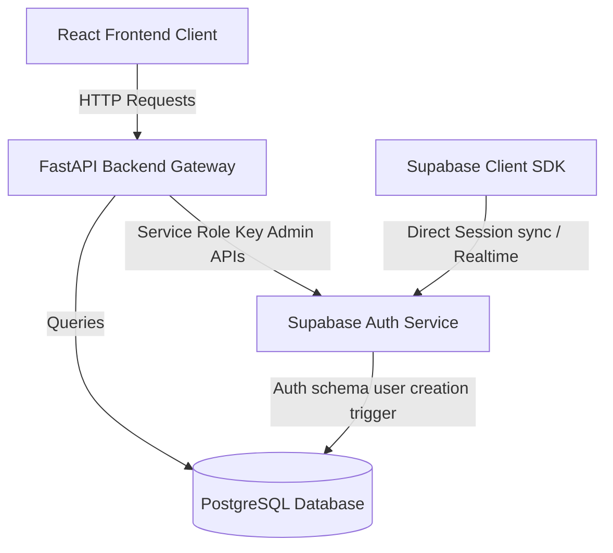

# Architectural Overview

SprintMind AI is built using a clean, decoupling architecture separating the React frontend SPA, the FastAPI backend gateway, and the Supabase PostgreSQL database.

---

## 1. Frontend Architecture
*   **Vite Single-Page Application**: Packaged using Vite and optimized for lightweight script delivery.
*   **Zustand State Store**: Tracks authentication states (`user`, `session`, `profile`) globally.
*   **React Router V6**: Manages public login, signup, and protected dashboard routers.
*   **Offline Mode Proxy Fallback**: In the absence of environment configuration keys, the client falls back to proxy-based mocked flows to avoid frontend runtime crashes.

---

## 2. Backend Gateway Architecture
*   **FastAPI API routing**: Mounts feature subrouters modularly under `/api`.
*   **Dependency Injection**: Resolves authenticated users via token validation dependencies (`get_token`, `get_current_user`, `get_current_profile`).
*   **Stateless Gateways**: Relies on bearer JWTs passed by the client browser in headers, validating credentials against Supabase Auth endpoints.
*   **Pydantic Data validation**: Applies Pydantic input models to validate request payloads (email formatting, password lengths, role choice rules).

---

## 3. Downstream Integrations
*   **Supabase (Auth & Database)**: The backend routes all login and signup actions through Supabase Auth. Trigger functions synchronize Auth user creation to the `public.user_profiles` database table, where RLS policies control reads and updates.
