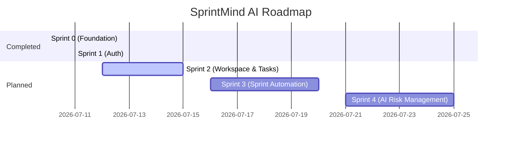

# Product Roadmap

This document outlines the planned incremental development phases for SprintMind AI.

---

## Roadmap Phases

---

## 1. Sprint 2: Workspace & Task Management (Next Sprint)
*   **Projects Management**: API endpoints and client UI to create, edit, and archive workspaces.
*   **Task Management**: Standard CRUD operations for tasks (assignees, priorities, due dates).
*   **Kanban Board UI**: Interactive board support for drag-and-drop status transitions (To Do, In Progress, Review, Done).

---

## 2. Sprint 3: AI-driven Sprint Planning
*   **Meeting Summaries**: Endpoint to ingest transcripts, process them using Google Gemini API (`gemini-1.5-flash`), and return structured tasks.
*   **APScheduler Integration**: Automated cron trigger mappings to handle weekly sprint rolls and automated cleanups.

---

## 3. Sprint 4: AI Risk Management & Analytics
*   **Risk Predication Dashboard**: AI analytics to identify sprint bottlenecks, team workloads, and project delays.
*   **Slack Notifications**: Integration of webhooks for automated daily summaries.
