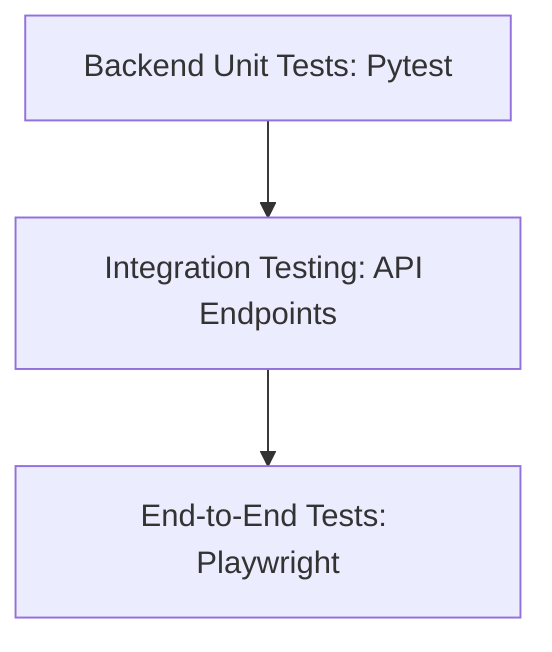

# Testing Strategy & Plan

SprintMind AI maintains a clean, multi-tiered testing strategy to verify the correctness, security, and responsiveness of the application.

---

## 1. Test Levels



### Backend Unit & Integration Tests (Pytest)
*   **Purpose**: Validates FastAPI configurations, middlewares, endpoint routing, and schema validation checks.
*   **Execution**:
    ```bash
    $env:PYTHONPATH="."
    venv/Scripts/pytest
    ```
*   **Key Coverage Areas**:
    - Route health check returns.
    - Security validation models (email formatting, password sizes).
    - API proxy handlers (signup/login/logout endpoints).

### Frontend E2E Browser Testing (Playwright)
*   **Purpose**: Validates page flows, forms, responsiveness, accessibility parameters, and intercepts console/network failures.
*   **Execution**:
    ```bash
    npx playwright test
    ```
*   **Key Coverage Areas**:
    - Sign up and log in success scenarios.
    - Input checking and custom error alerting.
    - Mobile/Tablet layout rendering.
    - Basic ARIA accessibility checks.

---

## 2. Test Environments

*   **Local Development**: Executed against local FastAPI (`localhost:8000`) and Vite Client (`localhost:5173`).
*   **Mocking Downstream APIs**: Third-party email sending rate limits are bypassed during E2E test runs using service-level mocks.
