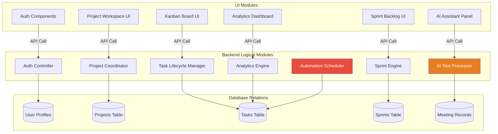
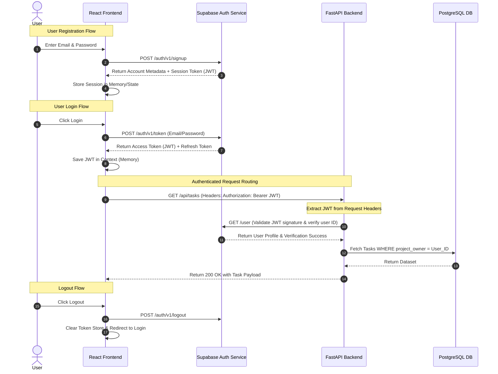
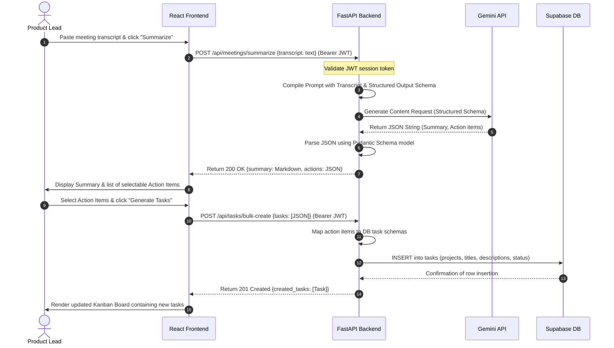
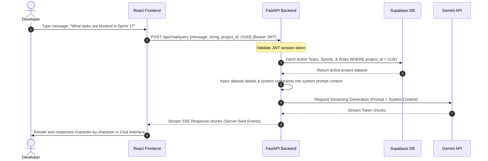
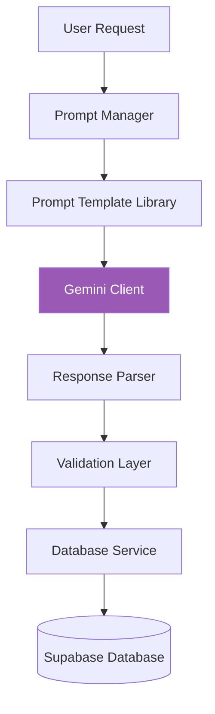

# Technical Architecture Document: SprintMind AI
## Engineering Design Specification (MVP Scope)
**Document Version:** 1.2.0  
**Author:** Principal Software Architect & Staff AI Engineer (ex-Microsoft)  
**Date:** July 10, 2026  
**Status:** Approved for MVP Implementation  

---

## 1. Overall System Architecture

SprintMind AI is designed using a clean, multi-tier client-server architecture model optimized for a solo-developer building an MVP portfolio application. The core focus is on V1 MVP features, utilizing serverless, managed, and developer-friendly platforms to reduce infrastructure overhead.

```mermaid
graph TD
    subgraph Client-Side (Vercel Edge Platform)
        A[React SPA Client] -->|State Management| B(Zustand / Context)
        A -->|Styling Framework| C(Tailwind CSS)
        A -->|HTTP Client| D(Axios / Fetch API)
    end

    subgraph API & Application Gateway (Render Cloud Web Service)
        E[FastAPI Web Server] -->|Router Layer| F[API Controller Endpoints]
        F -->|Request Validation| G[Pydantic Schema Validator]
        F -->|Auth Middleware| H[JWT Signature Verifier]
        F -->|Background Execution| I[APScheduler Worker]
    end

    subgraph Data & Identity Layer (Supabase Managed Service)
        K[(PostgreSQL Database)] -->|Access Control| L[Row Level Security RLS]
        M[Supabase Auth Service] -->|Tokens & Authentication| K
    end

    subgraph Cognitive AI Engine
        N[Gemini API Service]
    end

    %% Network & Protocol Mappings
    D -->|HTTPS / JSON REST| E
    D -->|HTTPS OAuth & Session| M
    F -->|TCP / PostgreSQL Protocol| K
    F -->|HTTPS REST / SDK| N
    I -->|Internal Database Calls| K
    
    style E fill:#4A90E2,stroke:#fff,stroke-width:2px,color:#fff
    style K fill:#2ECC71,stroke:#fff,stroke-width:2px,color:#fff
    style N fill:#9B59B6,stroke:#fff,stroke-width:2px,color:#fff
```

### Layer Details

#### 1. Presentation Layer (Frontend Client)
*   **Technologies**: React, TypeScript, Tailwind CSS, Vite.
*   **Hosting**: Vercel (Edge static single-page application hosting).
*   **Key Responsibilities**: Renders the Kanban task board, manages frontend views, captures user settings, interacts with meeting summarizer forms, connects to the AI chat interface, and displays charts.

#### 2. Services & Logic Layer (Backend Server)
*   **Technologies**: FastAPI, Python, Uvicorn.
*   **Hosting**: Render (Web Service deployment with automatic git integration).
*   **Key Responsibilities**: Processes backend requests, runs domain logic services, validates schemas, runs auth checkers, and executes automated scheduler routines.

#### 3. Database & Identity Layer
*   **Technologies**: Supabase (PostgreSQL), Supabase Auth.
*   **Key Responsibilities**: Handles relational user data storage and enforces dataset isolation rules. Supabase Auth processes registrations, logins, and session lifecycles.

#### 4. Cognitive & Automation Layer
*   **Technologies**: Gemini API (`gemini-1.5-flash`), Python APScheduler.
*   **Key Responsibilities**: Synthesizes unstructured meeting logs, answers contextual chat queries, drafts tasks, and performs cron-like database status reviews.

---

## 2. Component Architecture

The SprintMind AI codebase is designed as a set of decoupled, cohesive modules, allowing independent development and clear separation of concerns.



### Module Descriptions

*   **Authentication Module**: Manages logins, user registrations, session refresh cycles, and route guarding.
*   **Projects Module**: Handles workspace settings, project containers, and project-owner configurations.
*   **Tasks Module**: Orchestrates issue CRUD operations and validates task status transitions (`To Do` ➔ `In Progress` ➔ `In Review` ➔ `Done`).
*   **Sprint Module**: Manages sprint planning bounds, assigning backlog items to temporal sprint blocks, and tracking active sprint lifecycles.
*   **Meeting Assistant Module**: Synthesizes meeting text files/transcripts and handles task generation pipelines.
*   **AI Chat Module**: Handles conversation context compiling and queries the LLM dynamically.
*   **Reports & Analytics Module**: Formats database tracking variables for dashboard charts.
*   **Automation Module**: Handles scheduling and triggers background events.

### API Architecture Note
Each module will expose REST APIs. Detailed API specifications will be created during the API Design phase.

### Module Communication Patterns
1.  **Synchronous Communication**: Occurs via RESTful JSON HTTP calls between the React frontend and the FastAPI backend.
2.  **Asynchronous Background Tasks**: APScheduler runs job threads within the FastAPI application runtime, querying the database directly.
3.  **Third-Party AI Sync**: The backend initiates synchronous HTTPS calls to Google’s Gemini endpoints, parsing the responses before returning results to the client.

---

## 3. Authentication Flow

Authentication is managed via Supabase Auth. It acts as the identity provider, supplying JSON Web Tokens (JWT) to secure access.



### Authentication Lifecycle Details

*   **Signup**: The React client uses the Supabase Auth SDK to create a user account. Supabase generates a user record and returns an active session token.
*   **Login**: Authenticating with an email/password returns an Access Token (JWT) and a Refresh Token. The React app stores the JWT in context memory.
*   **JWT Processing**: Every API call to the protected FastAPI endpoints includes the JWT inside the HTTP `Authorization: Bearer <token>` header.
*   **Protected Routes**: React Router guards intercept navigation. If no active session token is present, the app redirects the user to the login screen.
*   **Role-Based Access**: Workspace routing rules verify that the authenticated user UUID matches the target resource owner ID at the backend and database levels.
*   **Logout**: Destroys the active session on the Supabase Auth server and clears client token state, redirecting the user back to the sign-in screen.
*   **Session Management**: The client library uses the Refresh Token to automatically request new Access Tokens before expiration.

---

## 4. Data Flow

These sequence diagrams outline how data flows through the application during core V1 MVP features.

### 4.1 Meeting Transcript to Task Generation (V1 MVP)



### 4.2 Interactive Context-Aware Chat (V1 MVP)



---

## 5. AI Architecture

The AI engine processes unstructured user inputs through a structured pipeline to ensure reliable data formatting and type safety before updating the database.



### Pipeline Layer Responsibilities

*   **User Request**: Receives user inputs (such as text chat prompts or meeting audio transcripts) from the API routing layer.
*   **Prompt Manager**: Compiles prompts by fetching template files, injecting active workspace variables (such as sprint dates or backlog status), and appending system rules.
*   **Prompt Template Library**: A folder containing parameterizable prompt files (`.md` format) stored in the codebase at `backend/prompts/`.
*   **Gemini Client**: A singleton client instance that handles communication with the Google Generative AI SDK, configuring the `gemini-1.5-flash` model, temperature settings, and output limits.
*   **Response Parser**: Extracts raw text blocks from the Gemini API and parses them into JSON format.
*   **Validation Layer**: Uses **Pydantic Schemas** to validate incoming JSON structures against defined Python data types (e.g., verifying date formats, field names, and value lists). If validation fails, it throws a structured exception.
*   **Database Service**: Map the validated Python dictionary objects to PostgreSQL database insert/update queries.

---

## 6. Database Architecture

Database design and migrations will be implemented during the Database phase. The tables, relationships, and responsibilities for the V1 MVP scope are defined below:

### Core Database Entities

#### 1. User Profiles (`user_profiles`)
*   **Responsibilities**: Stores user information mapped to Supabase Auth accounts.
*   **Relationships**: Primary key matches the Supabase Auth user ID (`uuid`). Has a one-to-many relationship with `projects`.

#### 2. Projects (`projects`)
*   **Responsibilities**: Serves as the primary container for all project workspaces.
*   **Relationships**: Belongs to a single User Profile. Has many `tasks`, `sprints`, and `meeting_summaries`.

#### 3. Sprints (`sprints`)
*   **Responsibilities**: Tracks sprint goals, start dates, end dates, and sprint statuses.
*   **Relationships**: Belongs to a single Project. Has many `tasks`.

#### 4. Tasks (`tasks`)
*   **Responsibilities**: Stores task tracking fields (title, description, status, priority, story points, due date).
*   **Relationships**: Belongs to a Project and can optionally be assigned to a Sprint.

#### 5. Meeting Summaries (`meeting_summaries`)
*   **Responsibilities**: Preserves raw transcripts and AI-generated meeting summaries.
*   **Relationships**: Belongs to a Project.

---

## 7. Automation Architecture (APScheduler)

SprintMind AI uses **APScheduler** running within the FastAPI server process to handle background utility jobs. The automation layer has the following MVP and Phase 2 responsibilities:

*   **Daily Reports (V2)**: Compiles daily standup summaries by checking completed issues and emails them to team members.
*   **Deadline Monitoring (V2/V3)**: Scans active task tables daily to identify items near their due dates, flagging risks or sending reminders.
*   **Weekly Summary (V2)**: Generates a project progress report at the end of each week for the Project Manager.
*   **Database Cleanup (MVP)**: Automatically runs database maintenance tasks (such as purging orphaned records or archiving stale tasks in the `Done` status).

---

## 8. Prompt Library Architecture

AI prompts are treated as version-controlled code assets stored inside the `backend/prompts/` folder. This ensures prompt updates are tracked alongside the rest of the application code.

### Prompt Assets
*   `meeting_summary.md`: Instructs the model to parse transcripts and return markdown summaries containing objectives, decisions, and action items.
*   `task_generator.md`: Instructs the model to parse action items and return valid JSON arrays matching the database task schema.
*   `sprint_planner.md`: Instructs the model to evaluate backlog priorities and assign tasks based on capacity.
*   `risk_detection.md`: Instructs the model to evaluate active sprint tasks and flag blockers or delays.
*   `project_chat.md`: Formulates system constraints and injects project data for the chatbot sidebar.

---

## 9. Folder Structure

SprintMind AI organizes its files using clean architecture principles, separating the React client, FastAPI service, and system documentation.

```
sprintmind-ai/
├── frontend/                   # React Client SPA
│   ├── public/
│   ├── src/
│   │   ├── assets/             # Images, Global Styles
│   │   ├── components/         # Reusable UI (Buttons, Modals, Kanban Card)
│   │   ├── context/            # AuthContext, ProjectContext
│   │   ├── hooks/              # Custom React Hooks (useKanban, useAuth)
│   │   ├── layouts/            # DashboardLayout, AuthLayout
│   │   ├── pages/              # Login, Dashboard, Board, Analytics, Chat
│   │   ├── services/           # Axios Client API wrappers
│   │   ├── store/              # Zustand global client-side state
│   │   ├── types/              # Client TypeScript Interfaces
│   │   ├── utils/              # Formatter functions, Chart Helpers
│   │   ├── App.tsx
│   │   └── main.tsx
│   ├── index.html
│   ├── tailwind.config.js
│   ├── tsconfig.json
│   └── package.json
│
├── backend/                    # FastAPI Backend Application
│   ├── app/
│   │   ├── routers/            # API Route Handlers (auth, tasks, projects)
│   │   ├── services/           # Business Logic (DB interactions, Gemini calls)
│   │   ├── schemas/            # Pydantic validation models
│   │   ├── models/             # ORM representation of database entities
│   │   ├── core/               # Security dependencies and DB connection wrappers
│   │   ├── utils/              # General helper utilities
│   │   ├── automation/         # APScheduler job managers
│   │   ├── prompts/            # Code-based prompt loaders
│   │   ├── config/             # Environment configuration mapping
│   │   └── main.py             # Server instantiation & router mappings
│   ├── prompts/                # Version-Controlled AI Prompt Assets (.md files)
│   │   ├── meeting_summary.md
│   │   ├── task_generator.md
│   │   ├── sprint_planner.md
│   │   ├── risk_detection.md
│   │   └── project_chat.md
│   ├── requirements.txt
│   └── README.md
│
├── database/                   # Schema migrations & database settings
│   ├── migrations/             # Migration tracking logs
│   ├── seeds/                  # Seed data scripts
│   └── rls_policies.sql        # Reference Supabase RLS definitions
│
├── shared/                     # Cross-project type definitions
│   └── types.json              # Shared payload structures schema
│
└── docs/                       # Project Documentation Library
    ├── BRD/                    # Business Requirements Documents
    ├── PRD/                    # Product Requirements Documents
    ├── Architecture/           # System Architecture & Diagrams
    ├── Database/               # Schema Design Specs & ERDs
    ├── Testing/                # Test Plans & Quality Assurance Reports
    ├── Deployment/             # Deployment Checklists & Env Configs
    ├── Release_Notes/          # Version Change Logs
    └── Portfolio_Case_Study/   # Developer Showcase Documentation
```

---

## 10. Technology Decisions

This section outlines the selection rationale, benefits, and tradeoffs for the chosen stack, focusing on practical execution for a solo developer.

### 10.1 React + TypeScript + Tailwind CSS
*   **Why Selected**: A standard combination for building responsive, type-safe web interfaces quickly.
*   **Benefits**: TypeScript flags errors during development, and Tailwind CSS provides inline utility classes that speed up page styling.
*   **Tradeoffs**: Managing client state requires structured patterns (e.g., Zustand) to prevent unnecessary re-renders.
*   **Alternatives**: Next.js (adds server configuration overhead) or Vue (smaller component ecosystem).

### 10.2 FastAPI
*   **Why Selected**: A fast, asynchronous web framework for building APIs in Python.
*   **Benefits**: Automatically generates Swagger interactive API documentation, integrates with Python's AI SDKs, and validates inputs using Pydantic.
*   **Tradeoffs**: Requires careful management of asynchronous operations (`async`/`await`) to avoid event-loop blocking.
*   **Alternatives**: Express/NodeJS (requires manual type definitions and validation setup) or Django (too complex for a simple API backend).

### 10.3 Supabase (PostgreSQL & Auth)
*   **Why Selected**: An open-source Backend-as-a-Service (BaaS) providing a hosted relational database and built-in user authentication.
*   **Benefits**: Simplifies backend infrastructure setup, handles user logins securely, and supports SQL structures needed for project planning.
*   **Tradeoffs**: Relies on a hosted platform, introducing platform lock-in.
*   **Alternatives**: Raw PostgreSQL + Auth0 (complex configuration) or Firebase (NoSQL structure makes sprint/task relationships difficult to model).

### 10.4 Gemini API
*   **Why Selected**: A fast and cost-effective large language model service.
*   **Benefits**: Large context window (excellent for long transcripts) and low response times.
*   **Tradeoffs**: Uptime is subject to third-party API availability.
*   **Alternatives**: OpenAI GPT-4o (more expensive developer tiers) or self-hosted models (high hosting costs and setup complexity).

### 10.5 Python APScheduler
*   **Why Selected**: A simple, in-app event scheduling library that handles background tasks.
*   **Benefits**: Runs inside the FastAPI process, requiring no separate infrastructure (like Celery and Redis).
*   **Tradeoffs**: If the server scales to multiple instances, scheduler instances could trigger duplicate jobs (mitigated by running a single instance on Render).
*   **Alternatives**: Celery + Redis (adds hosting costs and infrastructure complexity).

### 10.6 Vercel & Render Hosting
*   **Why Selected**: Zero-configuration, Git-integrated deployment platforms.
*   **Benefits**: Vercel handles frontend asset optimization, and Render hosts the backend server with minimal Docker configuration. Both offer zero-cost starter tiers.
*   **Tradeoffs**: Free tiers can lead to cold starts when the server is idle.
*   **Alternatives**: AWS ECS/RDS (high setup time and complex IAM permissions).

---

## 11. Future Enhancements (Version 2 & Version 3)

The V1 MVP focuses strictly on core features. The following capabilities are planned for future releases:

*   **GitHub Integration (V3)**: Webhook listeners that automatically transition task status based on commit messages and Pull Request reviews.
*   **Slack Integration (V3)**: Chatbots allowing users to query project health or create tasks directly from chat channels.
*   **Calendar Integration (V3)**: iCal feeds to sync sprint timelines and task deadlines with Google Calendar or Microsoft Outlook.
*   **Jira Integration (V3)**: Dynamic data migration tools to import active Jira tickets into SprintMind AI.
*   **RAG (Retrieval-Augmented Generation) (V3)**: Injecting wiki pages, architectural documents, and meeting notes into the AI Chat context.
*   **Vector Database (pgvector) (V3)**: Storing text embeddings in Supabase using pgvector to enable semantic search queries.
*   **System Webhooks (V3)**: Custom webhooks to notify external developer tools when task statuses change.
*   **Multi-LLM Support (V3)**: Fallback options to route prompts to alternative LLM APIs (like Anthropic Claude or OpenAI GPT) in case of outage.
