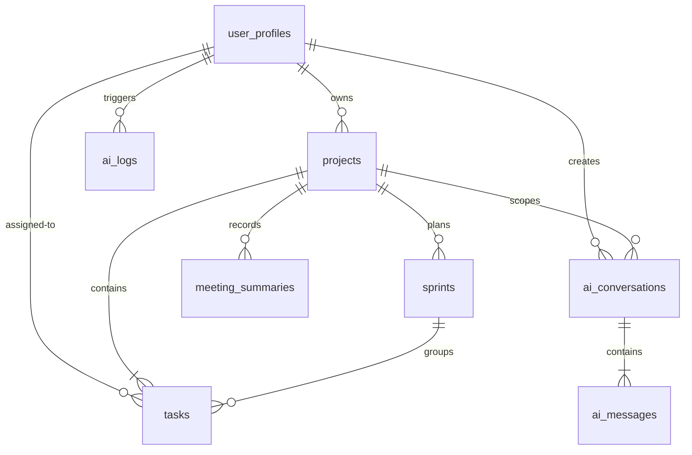

# Logical Database Design Specification: SprintMind AI
## Database Schema & Data Architecture Blueprint (MVP Focus)
**Document Version:** 1.0.0  
**Author:** Principal Database Architect  
**Date:** July 10, 2026  
**Status:** Approved for Schema Creation  

---

## 1. Database Overview

The purpose of the SprintMind AI database is to support transactional project management actions, coordinate sprint logs, save AI-generated summaries, and track AI conversational messages. The backend data architecture is built on a hosted **PostgreSQL** instance managed via **Supabase**.

### Design Philosophy
*   **Decoupled & Isolated**: Multi-tenant data structures are scoped cleanly. Workspace isolation is enforced at the database layer, ensuring users can only read or write records belonging to projects they own.
*   **Normalized Transactional Flow**: Core entities (Projects, Tasks, Sprints) follow relational design rules to prevent insert, update, or delete anomalies.
*   **AI Metadata Integration**: Log structures and chat transcripts are stored alongside traditional project management tables to ensure the AI assistant has immediate context without cross-database lookups.

### Normalization Approach
The database is designed to comply with **Third Normal Form (3NF)**:
1.  **First Normal Form (1NF)**: All attributes are atomic. There are no repeating groups or multi-valued columns.
2.  **Second Normal Form (2NF)**: All non-key attributes depend entirely on the primary key, eliminating partial dependencies.
3.  **Third Normal Form (3NF)**: No non-key attribute depends transitively on the primary key, separating concerns (e.g., project details are not duplicated inside task tables).

---

## 2. V1 Entities List

This list identifies only the core entities required for the **Version 1.0 (MVP)** release.

*   **User Profiles (`user_profiles`)**: Stores custom user metadata linked directly to the Supabase Auth login record.
*   **Projects (`projects`)**: The root container for all team tasks, sprints, and documents.
*   **Tasks (`tasks`)**: The primary work item (ticket) representing code deliverables.
*   **Sprints (`sprints`)**: A temporal container used to group and schedule tasks.
*   **Meeting Summaries (`meeting_summaries`)**: Preserves raw transcribed logs and AI-generated meeting summaries.
*   **AI Conversations (`ai_conversations`)**: Represents a persistent chat thread in the sidebar.
*   **AI Messages (`ai_messages`)**: Individual messages exchanged within an AI Conversation.
*   **AI Logs (`ai_logs`)**: Captures LLM API call metrics (latency, token usage, error status) for system analysis.

---

## 3. Entity Details

This section outlines the business metadata, keys, relationships, and lifecycles for the V1 entities.

### 3.1 User Profiles
*   **Purpose**: Connects authentication states to user details.
*   **Description**: Stores the user's name, display avatar, and system configurations.
*   **Primary Key**: `user_id` (UUID, derived directly from Supabase Auth UUID).
*   **Relationships**: Has a one-to-many relationship with `projects`.
*   **Business Rules**: Each user profile must map to exactly one record in the auth table.
*   **Ownership**: Owned by the authenticated user.
*   **Lifecycle**: Created via a backend trigger when a user completes registration. Hard-deleted if the user deletes their account.

### 3.2 Projects
*   **Purpose**: The central workspace container.
*   **Description**: Holds project metadata (name, description) and isolates project datasets.
*   **Primary Key**: `project_id` (UUID).
*   **Relationships**: Belongs to a single `user_profile` (the project owner). Has a one-to-many relationship with `tasks`, `sprints`, and `meeting_summaries`.
*   **Business Rules**: Project names must be unique for a given user profile.
*   **Ownership**: Owned by the creator (`user_id`).
*   **Lifecycle**: Created manually by the user. Deleting a project triggers a cascade delete for all linked tasks, sprints, summaries, and chat threads.

### 3.3 Tasks
*   **Purpose**: Tracks individual deliverables.
*   **Description**: Stores task descriptions, priorities, story points, assignee values, and status transitions.
*   **Primary Key**: `task_id` (UUID).
*   **Relationships**: Belongs to a `project` (required) and can optionally link to a `sprint` (nullable). Assigned to a `user_profile` (nullable).
*   **Business Rules**: Story points must be positive integers. A task cannot be assigned to a sprint that belongs to a different project.
*   **Ownership**: Scoped under the parent `project_id`.
*   **Lifecycle**: Created manually or by the AI task generator. Transitions status from `To Do` ➔ `In Progress` ➔ `In Review` ➔ `Done`. Hard-deleted when deleted by a user.

### 3.4 Sprints
*   **Purpose**: Tracks sprint scheduling.
*   **Description**: Groups tasks within defined start and end dates.
*   **Primary Key**: `sprint_id` (UUID).
*   **Relationships**: Belongs to a `project`. Has a one-to-many relationship with `tasks`.
*   **Business Rules**: The sprint end date must be after the start date. A project can have only one active sprint at a time.
*   **Ownership**: Scoped under the parent `project_id`.
*   **Lifecycle**: Created by a project manager. Transitions status from `Planned` ➔ `Active` ➔ `Completed`.

### 3.5 Meeting Summaries
*   **Purpose**: Records project meeting outputs.
*   **Description**: Stores meeting summaries, raw transcriptions, and generated action items.
*   **Primary Key**: `summary_id` (UUID).
*   **Relationships**: Belongs to a `project`. Created by a `user_profile`.
*   **Business Rules**: Transcripts must not be empty.
*   **Ownership**: Scoped under the parent `project_id`.
*   **Lifecycle**: Created when a transcript is processed by the AI Meeting Assistant. Hard-deleted if the user deletes the summary entry.

### 3.6 AI Conversations
*   **Purpose**: Groups AI chat messages.
*   **Description**: Represents a chat thread displayed in the sidebar.
*   **Primary Key**: `conversation_id` (UUID).
*   **Relationships**: Belongs to a `project` and a `user_profile`. Has a one-to-many relationship with `ai_messages`.
*   **Ownership**: Owned by the user profile within the project scope.
*   **Lifecycle**: Created when a user starts a new chat thread. Deleting a conversation cascades to delete all linked messages.

### 3.7 AI Messages
*   **Purpose**: Stores individual chat messages.
*   **Description**: Records prompts and responses along with their sender roles.
*   **Primary Key**: `message_id` (UUID).
*   **Relationships**: Belongs to an `ai_conversation`.
*   **Business Rules**: Role values are limited to `user` and `assistant`.
*   **Ownership**: Inherited from the parent `ai_conversation`.
*   **Lifecycle**: Created when a user sends a message or when the backend receives an LLM response.

### 3.8 AI Logs
*   **Purpose**: Tracks LLM API usage.
*   **Description**: Records metrics (tokens, latency, prompt templates) for system optimization.
*   **Primary Key**: `log_id` (UUID).
*   **Relationships**: Relates to a `user_profile` and can optionally link to a `conversation_id` or `summary_id`.
*   **Business Rules**: Token counts and latency metrics must be positive numbers.
*   **Ownership**: System record (read-only for users).
*   **Lifecycle**: Generated automatically by backend AI services. Retained for 30 days, then auto-purged by automation schedules.

---

## 4. Relationships (Entity-Relationship Diagram)

This diagram details the foreign key relationships and cardinalities across the V1 schema.

---

## 5. Data Dictionary

This section outlines fields, conceptual data types, and default values for all V1 tables.

### 5.1 `user_profiles` Table
| Field Name | Description | Conceptual Data Type | Required / Optional | Default Value | Validation Rules |
| :--- | :--- | :--- | :--- | :--- | :--- |
| `id` | Unique ID. | UUID | Required | Match Auth ID | Must be a valid UUIDv4 |
| `email` | Login email. | String | Required | None | Valid email pattern |
| `display_name` | Public username. | String | Required | None | 2–50 characters |
| `avatar_url` | Link to user avatar image. | String | Optional | Null | Valid URL structure |
| `created_at` | Account creation timestamp. | Timestamp | Required | Current Time | Date-time format |
| `updated_at` | Last update timestamp. | Timestamp | Required | Current Time | Date-time format |

### 5.2 `projects` Table
| Field Name | Description | Conceptual Data Type | Required / Optional | Default Value | Validation Rules |
| :--- | :--- | :--- | :--- | :--- | :--- |
| `id` | Unique ID. | UUID | Required | Auto UUIDv4 | Must be a valid UUIDv4 |
| `owner_id` | Creator profile. | UUID (FK) | Required | None | Must exist in `user_profiles` |
| `name` | Project name. | String | Required | None | 3–50 characters |
| `description` | Project description. | Text | Optional | Null | Max 500 characters |
| `created_at` | Creation timestamp. | Timestamp | Required | Current Time | Date-time format |
| `updated_at` | Last update timestamp. | Timestamp | Required | Current Time | Date-time format |

### 5.3 `sprints` Table
| Field Name | Description | Conceptual Data Type | Required / Optional | Default Value | Validation Rules |
| :--- | :--- | :--- | :--- | :--- | :--- |
| `id` | Unique ID. | UUID | Required | Auto UUIDv4 | Must be a valid UUIDv4 |
| `project_id` | Parent project. | UUID (FK) | Required | None | Must exist in `projects` |
| `name` | Sprint title. | String | Required | None | 3–50 characters |
| `start_date` | Start date. | Date | Required | None | Date format |
| `end_date` | End date. | Date | Required | None | Must be after `start_date` |
| `status` | Sprint status. | Enum | Required | `planned` | `planned`, `active`, `completed` |
| `created_at` | Creation timestamp. | Timestamp | Required | Current Time | Date-time format |
| `updated_at` | Last update timestamp. | Timestamp | Required | Current Time | Date-time format |

### 5.4 `tasks` Table
| Field Name | Description | Conceptual Data Type | Required / Optional | Default Value | Validation Rules |
| :--- | :--- | :--- | :--- | :--- | :--- |
| `id` | Unique ID. | UUID | Required | Auto UUIDv4 | Must be a valid UUIDv4 |
| `project_id` | Parent project. | UUID (FK) | Required | None | Must exist in `projects` |
| `sprint_id` | Active sprint. | UUID (FK) | Optional | Null | Must exist in `sprints` |
| `assignee_id` | Assignee. | UUID (FK) | Optional | Null | Must exist in `user_profiles` |
| `title` | Task title. | String | Required | None | 1–100 characters |
| `description` | Task description. | Text | Optional | Null | Max 2000 characters |
| `status` | Kanban status. | Enum | Required | `todo` | `todo`, `in_progress`, `in_review`, `done` |
| `priority` | Priority level. | Enum | Required | `medium` | `low`, `medium`, `high` |
| `story_points` | Task weight. | Integer | Optional | Null | Must be >= 0 |
| `due_date` | Due date. | Date | Optional | Null | Date format |
| `created_at` | Creation timestamp. | Timestamp | Required | Current Time | Date-time format |
| `updated_at` | Last update timestamp. | Timestamp | Required | Current Time | Date-time format |

### 5.5 `meeting_summaries` Table
| Field Name | Description | Conceptual Data Type | Required / Optional | Default Value | Validation Rules |
| :--- | :--- | :--- | :--- | :--- | :--- |
| `id` | Unique ID. | UUID | Required | Auto UUIDv4 | Must be a valid UUIDv4 |
| `project_id` | Parent project. | UUID (FK) | Required | None | Must exist in `projects` |
| `creator_id` | Creator profile. | UUID (FK) | Required | None | Must exist in `user_profiles` |
| `title` | Meeting title. | String | Required | None | 3–100 characters |
| `raw_transcript`| Raw input text. | Text | Required | None | Not empty |
| `summary_markdown`| AI generated summary. | Text | Required | None | Valid Markdown structure |
| `created_at` | Creation timestamp. | Timestamp | Required | Current Time | Date-time format |

### 5.6 `ai_conversations` Table
| Field Name | Description | Conceptual Data Type | Required / Optional | Default Value | Validation Rules |
| :--- | :--- | :--- | :--- | :--- | :--- |
| `id` | Unique ID. | UUID | Required | Auto UUIDv4 | Must be a valid UUIDv4 |
| `project_id` | Scoped project. | UUID (FK) | Required | None | Must exist in `projects` |
| `user_id` | Owner profile. | UUID (FK) | Required | None | Must exist in `user_profiles` |
| `title` | Conversational title. | String | Required | `New Chat` | Max 100 characters |
| `created_at` | Creation timestamp. | Timestamp | Required | Current Time | Date-time format |
| `updated_at` | Last update timestamp. | Timestamp | Required | Current Time | Date-time format |

### 5.7 `ai_messages` Table
| Field Name | Description | Conceptual Data Type | Required / Optional | Default Value | Validation Rules |
| :--- | :--- | :--- | :--- | :--- | :--- |
| `id` | Unique ID. | UUID | Required | Auto UUIDv4 | Must be a valid UUIDv4 |
| `conversation_id`| Parent chat thread. | UUID (FK) | Required | None | Must exist in `ai_conversations` |
| `role` | Message sender. | Enum | Required | None | `user`, `assistant` |
| `content` | Message body. | Text | Required | None | 1–4000 characters |
| `created_at` | Creation timestamp. | Timestamp | Required | Current Time | Date-time format |

### 5.8 `ai_logs` Table
| Field Name | Description | Conceptual Data Type | Required / Optional | Default Value | Validation Rules |
| :--- | :--- | :--- | :--- | :--- | :--- |
| `id` | Unique ID. | UUID | Required | Auto UUIDv4 | Must be a valid UUIDv4 |
| `user_id` | Triggering profile. | UUID (FK) | Required | None | Must exist in `user_profiles` |
| `feature` | Targeted AI module. | String | Required | None | e.g. `summarizer`, `chat`, `planner` |
| `latency_ms` | API latency. | Integer | Required | None | Must be > 0 |
| `token_usage` | Total tokens consumed. | Integer | Required | None | Must be >= 0 |
| `error_occurred` | Status flag. | Boolean | Required | `False` | True or False |
| `created_at` | Creation timestamp. | Timestamp | Required | Current Time | Date-time format |

---

## 6. Constraints

The database enforces data integrity using standard relational constraint rules.

### 6.1 Entity Constraints
*   **Required Fields**: Ensured by assigning non-nullable (`NOT NULL`) property configurations to crucial fields (e.g., `tasks.title`, `projects.name`, `ai_messages.content`).
*   **Unique Rules**:
    *   `user_profiles.email` must be unique across the platform.
    *   The combination of `projects.owner_id` + `projects.name` must be unique, preventing a user from duplicating project titles.

### 6.2 Relational Integrity & Cascades
*   **Project Cascade**: If a project record is deleted, all dependent tables (`tasks`, `sprints`, `meeting_summaries`, `ai_conversations`) are deleted (`ON DELETE CASCADE`).
*   **Auth Profile Sync**: If a user is deleted from the central authentication table, the linked record in `user_profiles` is deleted (`ON DELETE CASCADE`).
*   **Task Protection**: If a sprint is deleted, linked tasks are not deleted; instead, their `sprint_id` values are set to null (`ON DELETE SET NULL`), preserving the task records in the project backlog.

### 6.3 Temporal & Logic Constraints
*   **Sprint Date Validation**: A database check constraint enforces that `sprints.end_date` must be strictly after `sprints.start_date`.
*   **Story Points check**: A check constraint ensures that `tasks.story_points` must be greater than or equal to zero.
*   **Enum values constraint**: Status and priority values are validated against explicit string enumerations at the database layer.

---

## 7. Validation Logic Rules

This section outlines the validation rules enforced before database writes.

*   **Project Name**: Must contain between 3 and 50 characters, contain no leading or trailing whitespace, and consist of alphanumeric characters, hyphens, or underscores.
*   **Task Title**: Must contain between 1 and 100 characters. Single spaces are allowed, but it must not consist entirely of whitespace.
*   **Sprint Dates**: 
    *   *Start Date*: Must be equal to or greater than the current system date (during creation).
    *   *End Date*: Must be at least 1 day after the Start Date.
*   **Meeting Transcript**: Must contain valid UTF-8 text and have a minimum length of 50 characters, preventing empty inputs to the AI summarizer.
*   **AI Chat Message**: Input text must be between 1 and 4000 characters. The role value must match either `user` or `assistant`.
*   **User Profile**: Display names must be between 2 and 50 characters, containing no special character symbols (excluding underscores and spaces).

---

## 8. Database Naming Conventions

To ensure consistency across the application, the database schema follows unified naming standards:

*   **Tables**: Written in lowercase, snake_case, and pluralized format (e.g., `user_profiles`, `meeting_summaries`, `tasks`).
*   **Columns**: Written in lowercase, snake_case (e.g., `due_date`, `story_points`, `owner_id`).
*   **IDs**: The primary key for any table is named simply `id` and uses the UUID type.
*   **Foreign Keys**: Follows the pattern of referencing table singular name + `_id` (e.g., `project_id` references `projects.id`, `sprint_id` references `sprints.id`).
*   **Timestamps**: Named `created_at` (record insertion date) and `updated_at` (record update date), defaulting to the database server system timezone.
*   **Enums**: Pluralized enum names, with values written in lowercase snake_case (e.g., `task_status` enum contains: `todo`, `in_progress`, `in_review`, `done`).

---

## 9. Future Database Expansion

These tables support future capabilities (Version 2 & Version 3) and are excluded from the V1 MVP database schema.

### 1. Integration Mappings (`integrations`)
*   *Purpose*: Stores configuration details and credentials for third-party platforms (GitHub OAuth tokens, Slack webhook destinations, Calendar links).

### 2. Integration Event Logs (`integration_logs`)
*   *Purpose*: Logs webhook calls from GitHub and Slack to support audits and debugging.

### 3. Knowledge Document Chunks (`document_chunks`)
*   *Purpose*: Stores text snippets from imported project documentation.
*   *Columns*: `id` (UUID), `project_id` (UUID), `content` (Text), and `embedding` (Vector data type).
*   *Vector Search*: Utilizes Supabase's **pgvector** extension to save high-dimensional vectors representing document embeddings, enabling semantic search queries.

### 4. Automation Action Records (`automation_logs`)
*   *Purpose*: Tracks background cron jobs executed by APScheduler, including run status, run duration, and completed tasks.

### 5. Audit History (`audit_logs`)
*   *Purpose*: Tracks system mutations for security compliance, recording the user ID, event type, table name, and old/new value JSON objects.

### 6. Feature Flags (`feature_flags`)
*   *Purpose*: Enables feature toggles, allowing the team to roll out new features to selected user groups.
