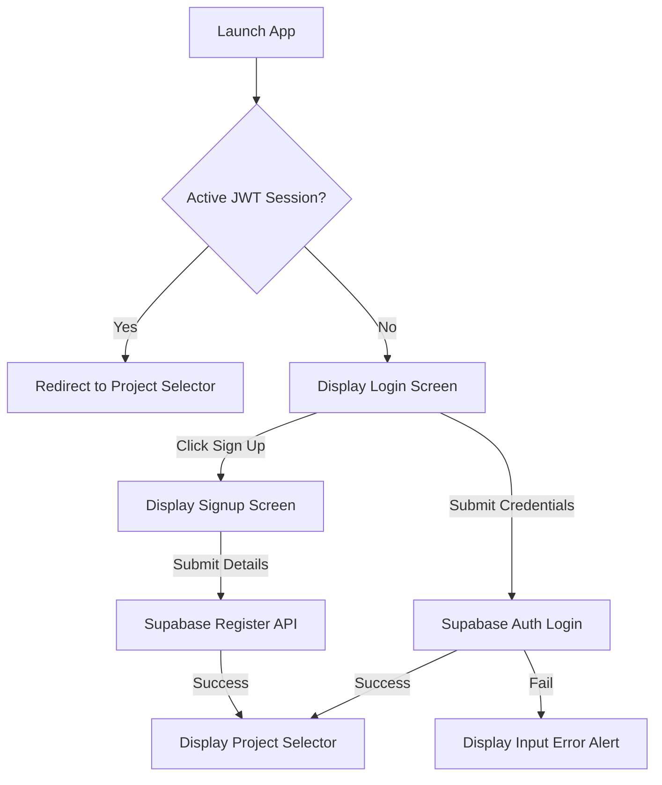
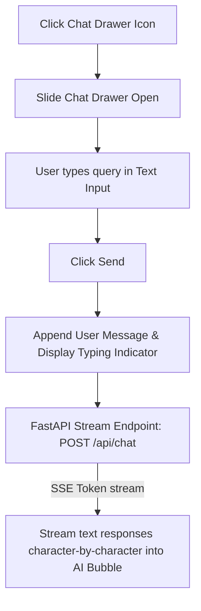

# UI/UX Design Specification: SprintMind AI
## Figma & Developer Handoff Blueprint (MVP Focus)
**Document Version:** 1.0.0  
**Author:** Principal Product Designer  
**Date:** July 10, 2026  
**Status:** Approved for Frontend Implementation  

---

## 1. Information Architecture

SprintMind AI’s navigation and screen relationships are designed to minimize nesting, keep developers in their active flow, and make AI actions accessible from any context.

```
Root Workspace
├── [Screen 1.0] Auth Suite (Login & Signup)
└── [Screen 2.0] Project Selector (Dashboard Root)
    └── [Screen 3.0] Selected Project Workspace (Sidebar Layout)
        ├── [Screen 3.1] Task Board (Kanban View)
        │     └── [Component] AI Chat Sidebar (Persistent Drawer)
        ├── [Screen 3.2] Sprint Backlog & Planner
        ├── [Screen 3.3] AI Meeting Summarizer & Task Ingest
        ├── [Screen 3.4] Reports & Burn-down Analytics
        └── [Screen 3.5] Workspace Settings & Profiles
```

### Navigational & Screen Explanations

1.  **Auth Suite**: Keeps registration and login isolated from app logic. Prevents navigation leaks prior to Supabase session creation.
2.  **Project Selector**: Provides a high-level entry gateway. Users choose their active project space, establishing the project context URL parameter (`/:projectId/`) that scopes all subsequent screen queries.
3.  **Selected Project Workspace**: Houses all functional pages within a consistent shell layout featuring a collapsible Left Navigation bar and a collapsible Right AI Chat drawer.
4.  **Task Board (Kanban)**: The default project view. Visualizes the active sprint backlog, enabling state changes (drag-and-drop transitions) on an interactive grid.
5.  **Sprint Board & Backlog Planner**: Focuses on scheduling. Allows PMs to group tasks into sprints, assign story points, and run the AI capacity estimator.
6.  **AI Meeting Assistant**: Ingests unstructured meeting audio transcripts and processes them. Bridges text summaries and database task row insertions.
7.  **Analytics & Reports**: Visualizes project status, burn-down metrics, and velocity. Focuses on providing immediate roadmap progress overviews.
8.  **Settings & Profiles**: Consolidates user configurations, profile changes, and light/dark theme switches.

---

## 2. User Flows

These diagrams outline the primary operational pathways for user interactions.

### 2.1 Authentication Flow


### 2.2 Create Project Flow
```mermaid
graph TD
    A[Project Selector Screen] --> B[Click "New Project"]
    B --> C[Render Modal Form]
    C -->|Fill Name & Description| D[Click "Create Project"]
    D --> E[FastAPI: POST /api/projects]
    E -->|201 Success| F[Close Modal & Route to Dashboard]
    E -->|Error| G[Display Validation Banner]
```

### 2.3 Invite Members Flow (V1 MVP Workspace Scoping)
```mermaid
graph TD
    A[Workspace Dashboard] --> B[Navigate to Workspace Settings]
    B --> C[Click "Invite Member" Button]
    C --> D[Open Overlay Dialog Form]
    D -->|Enter Email & Select Role| E[Click "Send Invitation"]
    E --> F[FastAPI: POST /api/workspace/invite]
    F -->|200 OK| G[Trigger Success Toast & Append Invitation List]
```

### 2.4 Create Task Flow
```mermaid
graph TD
    A[Kanban Board View] --> B[Click "+ Add Task" Card Button]
    B --> C[Open Task Details Modal Drawer]
    C -->|Enter Title, Priority, Due Date| D[Click "Save Task"]
    D --> E[FastAPI: POST /api/tasks]
    E -->|201 Created| F[Append Task Card to Board Column & Close Drawer]
```

### 2.5 Sprint Planning Flow
```mermaid
graph TD
    A[Sprint Planner Page] --> B[Click "Create Sprint" Button]
    B --> C[Input Sprint Name & Date Range]
    C --> D[Drag Tasks from Backlog Drawer to Active Sprint Container]
    D --> E[Click "Start Sprint"]
    E --> F[FastAPI: PATCH /api/sprints/:id/start]
    F -->|200 OK| G[Kanban Board updates to active sprint scope]
```

### 2.6 AI Meeting Summary Flow
```mermaid
graph TD
    A[AI Meeting Assistant Screen] --> B[Paste raw meeting transcript into Textarea]
    B --> C[Click "Generate Summary"]
    C --> D[Trigger Loader State & Call FastAPI: POST /api/meetings/summarize]
    D --> E[FastAPI calls Gemini API]
    E -->|Return JSON Summary| F[Parse & Render Markdown summary & Action Checklist]
    F --> G[Enable "Generate Tasks" options]
```

### 2.7 AI Sprint Planner Flow
```mermaid
graph TD
    A[Sprint Board] --> B[Click "Plan with AI" Button]
    B --> C[Trigger Loading Overlay & Call FastAPI: POST /api/sprints/plan]
    C --> D[Gemini calculates capacity against historical velocity]
    D --> E[Display recommended task allocation overlays in backlog]
    E -->|User clicks "Apply"| F[Database updates active sprint links & board refreshes]
```

### 2.8 AI Chat Flow


### 2.9 Analytics Flow
```mermaid
graph TD
    A[Click "Analytics" in Sidebar] --> B[FastAPI: GET /api/reports/analytics]
    B --> C[Aggregate velocity & burn-down calculations]
    C --> D[Render Interactive SVGs: Burn-down, Task Priority Distribution]
```

### 2.10 User Settings Flow
```mermaid
graph TD
    A[Click Settings in Sidebar Nav] --> B[Select Profile Tab]
    B -->|Modify Name or Switch Theme| C[Click "Save Configurations"]
    C --> D[FastAPI: PUT /api/user/profile]
    D -->|200 Success| E[Trigger Session sync & display toast notification]
```

---

## 3. Screen Inventory

This section catalog’s every interface screen required for the MVP build.

| Screen ID | Screen Name | Purpose | Primary User Goal | Primary Call-to-Action | Secondary Action | Key Components |
| :--- | :--- | :--- | :--- | :--- | :--- | :--- |
| **SM-100** | **Login & Signup** | Authenticate user workspace. | Access project dashboard. | `Submit Form` (Sign In) | `Switch to Sign Up` | Form cards, social login wrappers, validation status banners. |
| **SM-200** | **Project List Selector** | Choose or instantiate active project. | Select scoped workspace. | `Select Project Card` | `Create New Project` | Project grids, creation modals, skeleton loader tiles. |
| **SM-300** | **Task Kanban Board** | Manage daily development velocity. | Progress tasks to completion. | `+ Add Task` card trigger | `Drag & Drop Card` | Status columns, Kanban cards, Priority chips, User Avatars. |
| **SM-400** | **Sprint Backlog** | Scope active sprints. | Allocate backlog tasks to sprint container. | `Plan with AI` | `Create Sprint` | Backlog list, sprint timeline controls, allocation drawer. |
| **SM-500** | **AI Meeting Assistant** | Extract tasks from transcription. | Convert raw transcript to active tasks. | `Generate Summary` | `Create Tasks` | Ingest textarea, markdown output card, task selector table. |
| **SM-600** | **Analytics & Reports** | View sprint health. | Evaluate progress against commit dates. | `Change Sprint Filter` | `Export Report` | SVG Burn-down chart, progress bars, AI Risk alert cards. |
| **SM-700** | **Settings & Settings UI** | Configure workspace options. | Manage profiles and preferences. | `Save Settings` | `Toggle Dark Mode` | Tabbed settings cards, input forms, user profile panel. |

---

## 4. Wireframes (Low-Fidelity ASCII Layouts)

These low-fidelity diagrams establish the structural placement of elements.

### 4.1 Login Screen (SM-100)
```
+-------------------------------------------------------------+
|                                                             |
|                      SprintMind AI                          |
|                                                             |
|                  +-----------------------+                  |
|                  |     Welcome Back      |                  |
|                  |                       |                  |
|                  |  Email                |                  |
|                  |  [Enter email......]  |                  |
|                  |                       |                  |
|                  |  Password             |                  |
|                  |  [************]       |                  |
|                  |                       |                  |
|                  |  [   Sign In   ]      |                  |
|                  +-----------------------+                  |
|                  | Don't have an account?|                  |
|                  | Sign Up               |                  |
|                  +-----------------------+                  |
|                                                             |
+-------------------------------------------------------------+
```

### 4.2 Workspace Selection & Dashboard List (SM-200)
```
+-------------------------------------------------------------+
|  SprintMind AI   [Projects]   [Settings]        [Avatar]    |
+-------------------------------------------------------------+
|                                                             |
|   Workspaces                                 [+ New Project]|
|                                                             |
|   +-------------------+  +-------------------+              |
|   |  Payflow API      |  |  Internal Admin   |              |
|   |  Active tasks: 12 |  |  Active tasks: 4  |              |
|   |                   |  |                   |              |
|   |  [Open project]   |  |  [Open project]   |              |
|   +-------------------+  +-------------------+              |
|                                                             |
+-------------------------------------------------------------+
```

### 4.3 Task Kanban Board & AI Chat Sidebar (SM-300)
```
+-------------------------------------------------------------+
| Project: Payflow [Board] [Sprint] [Assistant] [Analytics]    |
+-------------------+--------------------+--------------------+
| TO DO             | IN PROGRESS        | DONE               |
+-------------------+--------------------+--------------------+
| [Card: Build Auth]| [Card: DB Sync]    | [Card: Setup UI]   |
| Priority: High    | Priority: Med      | Priority: Low      |
| Due: July 12      | Due: July 15       | Due: Completed     |
| [Avatar]          | [Avatar]           | [Avatar]           |
|                   |                    |                    |
| [ + Add Task ]    | [ + Add Task ]     | [ + Add Task ]     |
+-------------------+--------------------+--------------------+
| > AI Project Assistant (Chat Sidebar)             [Collapse]|
| +---------------------------------------------------------+ |
| | AI: Hello! Let me know if you need help with tasks.    | |
| | User: [Ask a question about the project...        ] [Send]|
| +---------------------------------------------------------+ |
+-------------------------------------------------------------+
```

### 4.4 AI Meeting Assistant Split View (SM-500)
```
+-------------------------------------------------------------+
| Project: Payflow [Board] [Sprint] [Assistant] [Analytics]    |
+-------------------------------------------------------------+
| Paste Transcript:          | AI Extraction Output:          |
| +------------------------+ | +----------------------------+ |
| | Paste meeting notes... | | | # Meeting Summary          | |
| |                        | | | **Objective**: Setup APIs  | |
| |                        | | |                            | |
| |                        | | | **Action Items**:          | |
| |                        | | | [x] Task 1: Create Database| |
| |                        | | | [ ] Task 2: Build Routers  | |
| +------------------------+ | +----------------------------+ |
| [ Generate Summary ]       | [ Convert to Active Tickets ]  |
+----------------------------+--------------------------------+
```

### 4.5 Analytics Dashboard layout (SM-600)
```
+-------------------------------------------------------------+
| Project: Payflow [Board] [Sprint] [Assistant] [Analytics]    |
+-------------------------------------------------------------+
| [ ACTIVE RISKS: 2 ]                     [ Active Sprint: 1 ]|
| - Task 'Build Auth' is overdue and unassigned.              |
|                                                             |
| Burn-down Chart (Planned vs Actual Progress)                |
| Story Points                                                |
| 100| \                                                      |
|  50|  \----..                                               |
|   0|_________\__________________                            |
|             Timeline (Days)                                 |
+-------------------------------------------------------------+
```

---

## 5. High-Fidelity Design Specifications

To establish a premium, developer-friendly interface reminiscent of modern tool suites (like Linear and Vercel), SprintMind AI uses a cohesive dark-first color scale and clear spacing tokens.

### 5.1 Color Tokens (Dark & Light Mode Themes)

```
Color Role      Dark Mode Value (Default)     Light Mode Value
──────────────  ───────────────────────────   ────────────────────────────
Background      #09090B (Zinc 950)            #FFFFFF (Pure White)
Panel Bg        #18181B (Zinc 900)            #F4F4F5 (Zinc 100)
Border          #27272A (Zinc 800)            #E4E4E7 (Zinc 200)
Text Primary    #FAFAFA (Zinc 50)             #09090B (Zinc 950)
Text Muted      #A1A1AA (Zinc 400)            #71717A (Zinc 500)
Brand Primary   #6366F1 (Indigo 500)          #4F46E5 (Indigo 600)
Brand Accent    #818CF8 (Indigo 400)          #6366F1 (Indigo 500)
Success         #10B981 (Emerald 500)         #059669 (Emerald 600)
Warning         #F59E0B (Amber 500)           #D97706 (Amber 600)
Destructive     #EF4444 (Red 500)             #DC2626 (Red 600)
```

### 5.2 Spacing & Grid System
*   **Base Spacing Unit**: 4px
*   **Spacing scale**:
    *   `xxs`: 4px (tight padding inside tags)
    *   `xs`: 8px (padding between icons and text, label gap)
    *   `sm`: 12px (general card padding elements)
    *   `md`: 16px (standard spacing layout, main component gaps)
    *   `lg`: 24px (padding on screen wrapper blocks)
    *   `xl`: 32px (margins between form containers)
    *   `xxl`: 48px (page header margins)
*   **Layout Grid**: 12-column layout on Desktop; flex-grow layouts with horizontal scrolls on Tablet/Mobile.

### 5.3 Typography (Inter Sans-Serif)
*   **Font Family**: `Inter, -apple-system, BlinkMacSystemFont, sans-serif;`
*   **Monospace Family**: `Fira Code, SFMono-Regular, Consolas, monospace;` (used for code strings and transcripts).
*   **Typography scale**:
    *   `H1 (Page Titles)`: 32px (Bold, Line height: 40px)
    *   `H2 (Section Headers)`: 24px (Semi-Bold, Line height: 32px)
    *   `H3 (Card Titles)`: 18px (Medium, Line height: 24px)
    *   `Body (Core Text)`: 14px (Regular, Line height: 20px)
    *   `Caption (Meta Labels)`: 12px (Regular, Line height: 16px)

### 5.4 Functional UI States

#### Empty States
*   *Design*: Center-aligned container using a 48px light grey icon container, a `Zinc-50` H3 title, a `Zinc-400` body copy description, and a single primary button.
*   *Interaction*: Direct link to the creator action (e.g., "Create your first Project").

#### Loading States
*   *Design*: Shimmer skeleton containers matching the target structure (e.g., rectangles representing cards, lists representing tasks) using a pulse animation class.
*   *Timing*: Triggers immediately when API latency exceeds 100ms.

#### Error States
*   *Design*: Red-bordered banners or input frames (`Destructive #EF4444` background opacity: 10%), with red bold text indicators and clear recovery buttons.

#### Success States
*   *Design*: Soft green banner triggers (Emerald 500 with 10% opacity) or float-up toast banners displaying quick confirmation checks.

---

## 6. Design System (Component Library)

SprintMind AI’s components are highly reusable, building consistent interfaces across all pages.

### Reusable Interface Elements

```
[Button] ── Primary / Secondary / Outlined / Icon Styles
[Input] ── Text field / Textarea / Dropdown wrappers
[Card] ── Container for task metadata and project items
[Status Chips] ── Todo (Blue/Grey), In Progress (Amber), In Review (Indigo), Done (Emerald)
[AI Chat Bubble] ── User (Zinc 900 alignment right), AI Assistant (Brand Tint alignment left)
```

1.  **Buttons**:
    *   *Primary*: Solid `#6366F1` background, `#FAFAFA` text, 6px border-radius.
    *   *Secondary*: Solid `#27272A` background, border `#3F3F46`, text `#FAFAFA`.
    *   *States*: Hover (+10% lightness overlay), Disabled (opacity 50%, pointer-events none).
2.  **Input Fields**:
    *   *Default*: Dark border `#27272A`, focus outline ring: `#6366F1` (inset border adjustment).
3.  **Kanban Cards**:
    *   *Properties*: Border `#27272A`, Background `#18181B`. Priority flags (`Low`, `Med`, `High`) aligned at bottom left, Assignee Avatar at bottom right. Subtask completion represented as a small progress indicator (e.g., `3/5 subtasks`).
4.  **AI Chat Components**:
    *   *Layout*: Chat feed uses sticky container alignments. Message container uses Markdown text parser wrappers.
5.  **Analytics Cards**:
    *   *Properties*: Clean, minimalist cards featuring simple progress rings (velocity targets) and SVG-based graph containers.

---

## 7. Responsive Design

The layouts dynamically scale to support multiple viewport sizes, keeping the interface usable on any device.

### Responsive Breakpoint Strategy

```
Desktop Layout (1440px+)  ➔  Tablet Layout (768px - 1024px)  ➔  Mobile Layout (<768px)
========================     =============================     ======================
• Left Nav: Persistent       • Left Nav: Collapsed to Icon Bar • Left Nav: Bottom Bar
• Main Board: 4 Columns      • Main Board: 2 Columns Scroll    • Main Board: Single Column Tabs
• AI Chat: Persistent Drawer • AI Chat: Overlay Drawer         • AI Chat: Bottom Sheet Sheet
```

*   **Desktop View (1440px)**: The left sidebar (240px width) is locked. The right AI Chat drawer (360px width) stays open next to the central 12-column workspace grid.
*   **Tablet View (768px–1024px)**: Left sidebar collapses to a thin icon-only column (64px width). The AI Chat transitions to an overlay drawer that slides in over the content when toggled via the navbar.
*   **Mobile View (<768px)**: Left sidebar converts to a bottom navigation bar. Kanban columns collapse into a single-column layout, and users use a tab selector (`To Do`, `In Progress`, `Done`) to switch between columns. The AI Chat sidebar transitions to a full-screen modal panel.

---

## 8. Accessibility (A11y)

SprintMind AI prioritizes accessibility to support all users.

*   **Color Contrast**: All text elements maintain a contrast ratio of at least **4.5:1** against the panel background. Text links and buttons maintain at least **7:1** against backgrounds, satisfying WCAG 2.1 AA targets.
*   **Keyboard Navigability**: Focus order matches the visual flow of components. Form fields and board cards support standard `Tab` navigation. Cards on the Kanban board can be moved between columns using `Space/Enter` key combinations.
*   **Screen Reader Support (ARIA)**:
    *   Chat inputs use `aria-label="AI Project Chat query"`.
    *   Interactive buttons use clear descriptions, e.g., `aria-expanded="false"` for collapsible sidebars.
    *   Streaming text blocks include `aria-live="polite"` tags to ensure screen readers read new tokens dynamically.
*   **Focus Ring Style**: Active focus states use a clear outlines ring: `focus:outline-none focus:ring-2 focus:ring-indigo-500 focus:ring-offset-2 focus:ring-offset-zinc-950`.

---

## 9. UX Decisions

These design decisions optimize the product layout for the core user workflows.

### UX Trade-off & Rationale Analysis

1.  **Drawer-Based AI Chat vs. Full-Page Chat Panel**:
    *   *Why Chosen*: A collapsible drawer on the right side of the screen allows users to query the AI assistant without losing context on their active task board.
    *   *Alternative Considered*: A dedicated full-page `/chat` route.
    *   *User Benefit*: Eliminates context switching. Users can ask queries and see the results update on the Kanban board in real-time.
2.  **Split Ingest Layout vs. Multi-Step Wizard for Meeting Summaries**:
    *   *Why Chosen*: A side-by-side layout (Input field on the left, AI Output on the right) gives users immediate feedback and clear context.
    *   *Alternative Considered*: A multi-step setup wizard (Step 1: Paste, Step 2: Processing, Step 3: View).
    *   *User Benefit*: Simplifies the workflow, making it faster to review transcripts and convert action items into tickets.
3.  **Click-to-Add Input Cards vs. Separate Task Modals**:
    *   *Why Chosen*: Click-to-Add inserts an input field directly in the Kanban column, allowing users to quickly create tasks.
    *   *Alternative Considered*: Opening a modal for every task creation.
    *   *User Benefit*: Accelerates backlog creation when drafting multiple tasks at once.

---

## 10. Developer Handoff Grid

This handoff grid maps each screen's layout, backend data requirements, and UI state changes for the development phase.

### 10.1 Task Kanban Board (Screen ID: SM-300)
*   **Component Hierarchy**:
    ```
    BoardLayout (Page Wrapper)
    ├── ProjectHeader (Workspace Title & Sprint Selector)
    ├── KanbanGrid (Container)
    │     ├── KanbanColumn (Grouped by status: Todo, In Progress, In Review, Done)
    │     │     ├── ColumnHeader (Title & count)
    │     │     ├── TaskCard (Draggable item)
    │     │     └── InlineAddInput (Visible on click)
    │     └── AI Chat Drawer (Persistent Overlay)
    ```
*   **Expected API Dependency**:
    *   `GET /api/projects/:id/tasks` (to fetch project tasks).
    *   `PATCH /api/tasks/:id` (to update task status on drag-and-drop).
*   **Required Data**:
    *   `taskId` (UUID), `title` (String), `status` (Enum), `priority` (Enum), `assigneeId` (UUID/Avatar url), `storyPoints` (Integer).
*   **Local States**:
    *   `isChatOpen` (Boolean), `activeDragTaskId` (UUID/Null), `isInlineAdding` (Boolean).
*   **Navigation Events**:
    *   Clicking a task card opens the `/tasks/:id` detail overlay.

### 10.2 AI Meeting Assistant (Screen ID: SM-500)
*   **Component Hierarchy**:
    ```
    AssistantLayout (Page Wrapper)
    ├── InputSection (Left Side)
    │     ├── TranscriptTextarea (Text input field)
    │     └── SubmitButton (Triggers summary)
    └── OutputSection (Right Side)
          ├── MarkdownSummaryCard (Displays AI output)
          └── ActionItemsTable (Checklist of tasks)
                └── SaveSelectedTasksButton (Inserts tasks to DB)
    ```
*   **Expected API Dependency**:
    *   `POST /api/meetings/summarize` (sends transcript to Gemini).
    *   `POST /api/tasks/bulk-create` (saves generated tasks).
*   **Required Data**:
    *   Input: `rawText` (String).
    *   Output: `summaryMarkdown` (String), `actionItems` (Array of objects containing Title, Assignee, Priority).
*   **Local States**:
    *   `isProcessing` (Boolean), `summaryGenerated` (Boolean), `selectedItems` (Array of indices).
*   **Navigation Events**:
    *   Clicking "Save Tasks" redirects users to the Kanban Board (`SM-300`).
