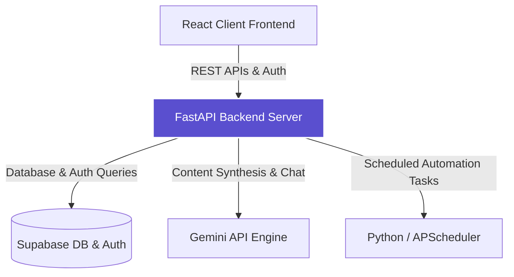

# Product Requirements Document (PRD): SprintMind AI
## AI-Powered Project Management Assistant (MVP & Portfolio Specification)
**Document Version:** 1.1.0  
**Author:** Principal Product Manager (ex-Microsoft, Atlassian, OpenAI)  
**Date:** July 10, 2026  
**Status:** MVP Blueprint / Ready for Development  

---

## 1. Product Vision

**SprintMind AI** is a lightweight, AI-native project management assistant designed for startups, indie developers, and small software teams. The product eliminates the administrative overhead of agile workflows by acting as an active intelligence layer over your task backlog. Instead of functioning as a passive database that requires manual logging, SprintMind AI automates the administrative lifecycle of software planning—from meeting transcripts to structured tasks, and from sprint scheduling to risk detection.

By leveraging a developer-friendly tech stack (React, FastAPI, Supabase, and the Gemini API), SprintMind AI bridges the gap between unstructured communication and structured execution. It enables teams to write code, conduct brief meetings, and maintain clean roadmaps without the friction and bloat of legacy enterprise tools.



### Core MVP Pillars
1. **Intelligent Automation**: Convert meeting audio/text transcripts directly into structured, database-backed tasks in seconds.
2. **Context-Aware Assistance**: An interactive project chat interface that understands your current backlog, sprint state, and project scope.
3. **Proactive Planning**: AI-driven task estimation and sprint capacity recommendations based on priority and velocity.
4. **Developer-First Simplicity**: Clean, lightning-fast Kanban views and analytics without enterprise configuration bloat.

---

## 2. Problem Statement

Small software teams, startup founders, and technical managers face severe productivity leaks due to the administrative overhead of project management:

*   **Task Overhead Friction**: Writing user stories, creating subtasks, and assigning priorities takes up hours of engineering and product leadership time.
*   **The Meeting-to-Task Gap**: Action items, architectural decisions, and product requirements discussed in standups and planning meetings frequently fail to materialize as tickets, leading to lost context.
*   **Unclear Sprint Commitment**: Without data-driven estimation, teams overcommit or undercommit during planning, disrupting velocity and delivery dates.
*   **Context Fragmentation**: Critical project status details are scattered across chat tools, documents, and code commits, making it difficult to answer simple status questions.
*   **Tooling Bloat**: Traditional tools (like Jira Enterprise) are built for heavy corporate compliance, requiring complex configuration and introducing slow loading speeds that alienate developers.

---

## 3. Business Goals & Portfolio Objectives

Rather than targeting enterprise-level sales, multi-million dollar annual recurring revenue, or SOC-2 certifications, SprintMind AI focuses on productivity improvements and proving high-caliber product engineering capabilities:

*   **Reduce PM Administrative Overhead**: Decrease the weekly time spent by product/project managers on manually writing, detailing, and updating tickets by **50%**.
*   **Improve Sprint Predictability**: Leverage AI estimations to align sprint capacity within **15%** of historical team velocity, reducing rolled-over tasks.
*   **Improve Meeting Documentation**: Ensure that **100%** of critical decisions and action items from product meetings are documented and converted to active tickets instantly.
*   **Enhance Project Visibility**: Provide a unified dashboard and project chat interface that answers status queries in real-time, eliminating manual status-gathering messages.
*   **Showcase Technical Product Execution**: Deliver a production-quality portfolio application demonstrating advanced AI prompt engineering, structured state management, responsive UI/UX, and robust automation pipelines.

---

## 4. Functional Requirements

To ensure a realistic and timely development cycle, features are divided into three progressive release versions.

### Version 1.0 (MVP) - Core Project Engine & AI Co-pilot
*   **FR-1.1: Authentication & User Accounts**
    *   *Specification*: Users must be able to sign up, log in, and log out securely using Email and Password via **Supabase Auth**.
    *   *UI/UX*: Simple, clean Login and Registration pages with basic validation.
*   **FR-1.2: Project Workspace (CRUD)**
    *   *Specification*: Users can create, read, update, and delete Projects. Each project has a name, description, and owner ID mapped to the authenticated user.
*   **FR-1.3: Interactive Kanban Task Board (CRUD)**
    *   *Specification*: Full CRUD interface for Tasks. Every task contains a title, description, status (`To Do`, `In Progress`, `In Review`, `Done`), priority (`Low`, `Medium`, `High`), assignee, due date, and story points.
    *   *UI/UX*: Drag-and-drop task board interface powered by Tailwind CSS.
*   **FR-1.4: Sprint Management**
    *   *Specification*: Users can create sprints with defined start/end dates. Tasks in the backlog can be assigned to active or upcoming sprints.
*   **FR-1.5: AI Meeting Summarizer**
    *   *Specification*: A text ingestion interface where users paste raw transcripts (e.g., from Zoom, Meet, or Teams). The backend calls the **Gemini API** using a structured prompt to return a formatted Markdown meeting summary containing:
        *   Meeting Objective
        *   Key Discussion Points
        *   Decisions Made
        *   Action Items (with suggested owner and due date)
*   **FR-1.6: AI Task Generator**
    *   *Specification*: Integrates with the Meeting Summarizer. Users can select action items from the summary and click "Generate Tasks" to automatically create structured tickets directly in their project backlog.
*   **FR-1.7: AI Sprint Planner**
    *   *Specification*: Evaluates backlog tasks and recommends which issues to include in the next sprint based on task priority, estimated story points, and team capacity constraints.
*   **FR-1.8: AI Project Chat Assistant**
    *   *Specification*: A sidebar chat window. The assistant utilizes the Gemini API, injecting current project statistics, task list structures, and active sprint data into the prompt window to answer user queries (e.g., *"What high-priority tasks are due this week?"* or *"List all unassigned tasks"*).
*   **FR-1.9: Basic AI Risk Detection**
    *   *Specification*: A background analytical script that highlights active sprint risks in a dedicated dashboard card:
        *   Overdue tasks still marked `In Progress`.
        *   High-priority tasks without assignees.
        *   Sprint scope-creep warnings (too many story points added after the sprint started).
*   **FR-1.10: Basic Reports & Analytics**
    *   *Specification*: Dashboard visualizations showing:
        *   Current Sprint Burn-down Chart (planned vs. actual completion).
        *   Task distribution by status and priority (using clean charts, e.g., Recharts).
        *   Team velocity metrics over historical sprints.

---

### Version 2.0 - Automation & Communication Loop
*   **FR-2.1: Python-based Automation Engine**
    *   *Specification*: Utilize **APScheduler** in the FastAPI backend to run automated background housekeeping scripts:
        *   *Auto-Archive*: Auto-archives tasks in `Done` state older than 14 days.
        *   *Stale Warn*: Flags tasks in `In Progress` with no updates for over 72 hours.
*   **FR-2.2: Scheduled Email Notifications**
    *   *Specification*: Send daily summary emails to users containing overdue tasks and sprint status using a simple email integration (e.g., Resend or SendGrid).
*   **FR-2.3: Automated Daily Standup Collator**
    *   *Specification*: An interface that aggregates the previous day's completed tasks and today's planned tasks for each user, formatting them into a standard standup message template.
*   **FR-2.4: Weekly Project Report Generator**
    *   *Specification*: Automatically drafts a weekly email report summarizing sprint progress, completed story points, and outstanding risks, delivering it directly to the Project Manager's inbox.
*   **FR-2.5: Release Notes Generator**
    *   *Specification*: A button that prompts the Gemini API to compile all tasks in `Done` status from the completed sprint and write a customer-facing, developer-friendly release notes document.

---

### Version 3.0 - Integrations, RAG, & Advanced AI
*   **FR-3.1: GitHub Integration**
    *   *Specification*: Read-only integration with GitHub. A webhook listener triggers automatic task transitions (e.g., moving a task to `In Review` when a linked Pull Request is opened, or to `Done` when the PR is merged).
*   **FR-3.2: Slack Integration**
    *   *Specification*: A Slack command integration allowing users to search backlog items or create a task directly from a message.
*   **FR-3.3: Calendar Integration**
    *   *Specification*: Sync sprint start/end dates and high-priority task due dates to external calendar systems (Google Calendar or Outlook) via custom iCal feeds.
*   **FR-3.4: RAG-Powered Project Knowledge Base**
    *   *Specification*: Integrates wiki pages, architectural documents, and meeting notes. Documents are vectorized using the Gemini embeddings model and stored in **Supabase pgvector**. The Project Chat Assistant queries this vector store to answer domain-specific questions.
*   **FR-3.5: Predictive AI Velocity Forecasting**
    *   *Specification*: Employs regression algorithms in Python to predict future sprint delivery dates based on individual developer velocity patterns.
*   **FR-3.6: System Webhooks**
    *   *Specification*: Outbound webhooks that ping custom user URLs when tasks are updated or risks are detected.

---

## 5. Non-Functional Requirements

These requirements ensure the application is reliable, secure, responsive, and maintainable by a single developer:

### 1. Performance & Latency
*   **API Response Time**: Core REST API endpoints (FastAPI) must respond in under **250ms** under standard database loads.
*   **LLM Processing Limit**: Text summarizations and AI chat operations must stream or return completed data in under **5 seconds** without blocking the user interface.
*   **Load Speeds**: Initial page loads for the React application on Vercel must complete in under **1.5 seconds** (on broadband connections).

### 2. Security & Data Protection
*   **Row-Level Security (RLS)**: Enforce Supabase RLS policies strictly. Users must only access projects, tasks, and sprints associated with their workspace/organization.
*   **Credential Masking**: Credentials, database connection strings, and Gemini API keys must be securely stored in system environment variables (using dotenv in development, and native Vercel/Render key stores in production).
*   **Transit Encryption**: All communication between the React frontend, FastAPI backend, Supabase DB, and Gemini API must utilize HTTPS.

### 3. Scalability
*   **Concurrent Connections**: The system must support up to **50 active concurrent users** without degradation, making standard Supabase and Render hobby tiers sufficient.

### 4. Usability & Responsive Design
*   **Mobile-First Design**: The application must be fully responsive, with the dashboard, task boards, and chat components rendering correctly on mobile, tablet, and desktop screens.
*   **Theme Consistency**: Clean, modern dark and light mode styling configured using Tailwind CSS variables.

### 5. Accessibility
*   **Semantic Markup**: Standard HTML5 semantic elements must be used (`<main>`, `<section>`, `<nav>`, `<button>`).
*   **ARIA attributes**: Focus states and ARIA labeling must be implemented on custom dropdowns and modal interfaces to support screen readers.

### 6. Robust Error Handling & Resiliency
*   **Service Failures**: If the Gemini API or Supabase DB fails temporarily, the application must catch the exception, display a user-friendly error message, and suggest a retry, preventing application crashes.
*   **Empty States**: Clear UI feedback must be displayed when a user has no projects, tasks, or sprints active.

### 7. Logging & Monitoring
*   **Backend Logs**: FastAPI must log structured API errors and LLM payload processing details to standard output, accessible via the Render logging console.
*   **Frontend Logs**: Production builds must suppress verbose console logs while capturing critical execution exceptions.

### 8. Backups
*   **Database Retention**: Rely on Supabase's automatic daily backup schedules to ensure point-in-time recovery for database states.

---

## 6. Target Audience

SprintMind AI is tailored for:
*   **Technical Founders & Solo Creators**: Leading small software projects who need a quick, unified interface to plan issues, parse user calls, and manage tasks.
*   **High-Growth Startups (Teams of 2–15)**: Teams that prioritize fast-moving development over corporate configuration meetings.
*   **Indie Hackers & Portfolio Builders**: Technical professionals looking for an intelligent workspace that assists in structuring their code backlogs and estimating features.

---

## 7. User Personas

### Persona A: Sarah — Agile Project Manager / Product Manager
*   **Context**: Works at a fast-moving, 8-person web software startup.
*   **Needs**: Rapid backlog formatting, immediate action-item extraction from client feedback meetings, and quick sprint setup.
*   **Pain Points**: Spends too many hours grooming the backlog and drafting detailed requirements when she could be talking to customers.
*   **SprintMind AI Value**: Instantly generates sprint tasks from raw client call notes, keeping the backlog groomed automatically.

### Persona B: David — Scrum Master / Engineering Lead
*   **Context**: Oversees daily operations of a small, distributed development squad.
*   **Needs**: Tracking sprint velocity, identifying developer blockages, and monitoring sprint health.
*   **Pain Points**: Chasing developers for status updates and finding out about sprint delays too late.
*   **SprintMind AI Value**: Basic AI Risk Detection highlights overdue items, while the AI Chat Sidebar provides an immediate overview of blockers.

### Persona C: Alex — Full-Stack Developer
*   **Context**: Focuses primarily on writing code.
*   **Needs**: Clear, atomic task specifications and minimal meeting overhead.
*   **Pain Points**: Hates entering a project management tool to manually write out subtasks or log descriptions.
*   **SprintMind AI Value**: AI Task Generator drafts subtasks automatically, allowing Alex to focus on building features.

### Persona D: Marcus — Startup Founder (Technical)
*   **Context**: Operates a bootstrapped project alone, managing coding, product decisions, and deployment.
*   **Needs**: A unified tool that helps him summarize brainstorming meetings, plan sprints, and keep track of overall release health.
*   **Pain Points**: Lacks a team to discuss estimations and risks with; managing spreadsheets and code repositories is slow.
*   **SprintMind AI Value**: Serves as a digital co-founder, assisting in sprint estimation, auto-drafting issues, and warning him of timeline risks.

---

## 8. User Journey (MVP-Only Focus)

This sequence maps how a user interacts with the V1.0 MVP during a standard sprint cycle:

```
[Register/Login via Supabase] ➔ [Create Project Workspace] ➔ [Paste Meeting Transcript]
                                                                     │
                                                                     ▼
[Track Sprint Analytics] ◄─── [Review AI Risks] ◄─── [AI Sprint Planner] ◄─── [AI Task Generation]
```

1.  **Onboarding**: The Project Manager (Sarah) registers an account via Supabase Auth and creates a new project space named *“Customer Dashboard v1”*.
2.  **Creating Backlog via AI**: Sarah pastes a 10-minute brainstorming transcript from Google Meet into the **AI Meeting Assistant**. The system generates a formatted Markdown summary and proposes 6 specific developer tasks.
3.  **Task Insertion**: Sarah clicks the checkmark next to the proposed tasks. The **AI Task Generator** instantly inserts them into the project’s Supabase database.
4.  **Sprint Planning**: Sarah goes to the Sprint Management view. She runs the **AI Sprint Planner**. The system reads the backlog, reviews priorities, and automatically drafts Sprint 1, assigning a realistic set of tasks that align with her team size.
5.  **Kanban Progress**: The team moves tickets on the drag-and-drop board (`To Do` ➔ `In Progress` ➔ `Done`) during sprint execution.
6.  **Interactive Status Querying**: Sarah wants a quick project check. She opens the **AI Project Chat** sidebar and asks, *"What tasks are currently in review, and are any overdue?"*. The Gemini API processes the database state and displays a clean bulleted report.
7.  **Analytics & Risk Assessment**: The team views the dashboard, reviewing the active Burn-down chart and the **AI Risk Detection** card, which alerts them that a high-priority task is nearing its due date without an assignee.

---

## 9. Key Performance Indicators (KPIs)

SprintMind AI tracks product engagement and productivity improvements rather than complex corporate financial metrics:

### 1. Product Engagement Metrics
*   **AI Acceptance Rate**: Percentage of AI-generated tasks and sprint allocations approved by the user. *Target: >80%*.
*   **Feature Utilization**: Weekly count of meeting transcripts processed and AI project chat interactions. *Target: >3 meetings processed per user per week*.
*   **Daily Active Usage (DAU/MAU)**: The ratio of users who check the task board daily vs. monthly. *Target: >50%*.

### 2. Team Productivity & Value Realization
*   **Administrative Time Saved**: Self-reported reduction in weekly hours spent drafting tickets and planning sprints. *Target: >3 hours saved per week per user*.
*   **Backlog Cleanliness Index**: Ratio of structured tasks (with story points, assignees, and priorities) to empty tasks. *Target: >90% of tasks detailed*.
*   **Sprint Commit Reliability**: Ratio of completed story points to planned story points in a completed sprint. *Target: Completion rates consistently between 80% and 95%*.

---

## 10. Competitive Analysis

SprintMind AI is positioned as a **lightweight, AI-first project management assistant** for startups and growing teams. It does not attempt to replace Jira Enterprise or Azure DevOps, which are designed for compliance, corporate governance, and complex multi-team scaling.

### Comparative Positioning

| Feature / Metric | **SprintMind AI (MVP)** | **Jira AI** | **Linear** | **Notion AI** |
| :--- | :--- | :--- | :--- | :--- |
| **Primary Target** | High-growth startups & Portfolio Builders | Enterprise Corporations | Fast-scaling Tech Teams | General Knowledge Workers |
| **AI Integration** | **Native Core Engine** (Transcripts to tickets, interactive chat) | Add-on text utility inside ticket text fields | Limited text summarizing tools | General text writing/editing |
| **Setup Time** | **< 3 minutes** (Instant DB & Auth instantiation) | High configuration overhead | Very low configuration | Low configuration |
| **UX Focus** | Simple, responsive Kanban + AI Chat | Complex hierarchies & reporting | Speed, keyboard shortcuts | Structured documents & wikis |
| **Core Edge** | Direct workflow generation from unstructured transcripts | Massive corporate ecosystem | Extreme manual speed | Document-based general search |

#### Positioning Strategy:
*   **Against Jira**: SprintMind AI avoids complex setup structures. Instead of requiring users to design workflows and permission hierarchies, SprintMind AI provides an instant, AI-assisted path from raw meeting text to an active project dashboard.
*   **Against Linear**: Linear is exceptionally fast but relies entirely on manual issue creation and tracking. SprintMind AI fills this gap by acting as an automated project manager that drafts tasks, recommends sprint schedules, and flags risks.
*   **Against Notion**: Notion is a general-purpose editor. SprintMind AI is specifically engineered around structured agile software delivery, complete with sprints, burndowns, and developer velocity metrics.

---

## 11. Product Roadmap

This 16-phase roadmap provides a sequential plan for a single developer to build, verify, and deploy SprintMind AI as a production-ready portfolio application within 8 to 12 weeks.

```
┌────────────────────────────────────────────────────────┐
│  Phase 0: Discovery & Setup (Weeks 1-2)                │
│  [Discovery] ➔ [Planning] ➔ [Architecture]            │
└───────────────────────────┬────────────────────────────┘
                            ▼
┌────────────────────────────────────────────────────────┐
│  Phase 1: DB, API & Core UI (Weeks 3-5)                │
│  [DB/API Design] ➔ [UI/UX Config] ➔ [Auth]             │
└───────────────────────────┬────────────────────────────┘
                            ▼
┌────────────────────────────────────────────────────────┐
│  Phase 2: Core PM Modules (Weeks 6-8)                  │
│  [Projects] ➔ [Tasks] ➔ [Sprints]                      │
└───────────────────────────┬────────────────────────────┘
                            ▼
┌────────────────────────────────────────────────────────┐
│  Phase 3: AI Engine Integration (Weeks 9-10)           │
│  [Meeting Summaries] ➔ [Task Gen] ➔ [Chat] ➔ [Planning]│
└───────────────────────────┬────────────────────────────┘
                            ▼
┌────────────────────────────────────────────────────────┐
│  Phase 4: Automation, Analytics & Deploy (Weeks 11-12) │
│  [Automation Engine] ➔ [Analytics] ➔ [Testing] ➔ [Deploy]│
└────────────────────────────────────────────────────────┘
```

### Phase 0: Product Discovery
*   [ ] Conduct user interviews or competitor reviews to refine feature prioritization.
*   [ ] Map primary user flows and technical input/output requirements.
*   [ ] Define prompt templates for the Gemini API meeting summary and task generation modules.

### Phase 1: Product Planning
*   [ ] Finalize technical architecture diagrams and data-flow charts.
*   [ ] Draft API endpoint signatures (FastAPI) and Supabase database schemas.
*   [ ] Establish the GitHub repository structure and project branching strategy.

### Phase 2: Architecture
*   [ ] Initialize the React frontend repository using TypeScript, Vite, and Tailwind CSS.
*   [ ] Initialize the FastAPI backend repository with virtual environments.
*   [ ] Install and configure core libraries: `@supabase/supabase-js`, `google-generativeai`, `pydantic`, and `uvicorn`.

### Phase 3: Database & API Design
*   [ ] Create Supabase tables with appropriate relationships: `projects`, `tasks`, `sprints`, and `user_profiles`.
*   [ ] Configure Row-Level Security (RLS) policies on all tables to isolate data by user ID.
*   [ ] Develop and test core FastAPI CRUD router structures.

### Phase 4: UI/UX
*   [ ] Develop Figma design mockups for the dashboard, Kanban board, and AI Sidebar components.
*   [ ] Set up Tailwind CSS typography, color variables, and responsive layout foundations in the React codebase.
*   [ ] Create reusable UI components: Buttons, Modals, Loaders, and Tooltips.

### Phase 5: Authentication
*   [ ] Implement sign-up, sign-in, password reset, and logout screens in React.
*   [ ] Integrate Supabase Client Auth session tracking.
*   [ ] Build frontend route guards to block unauthorized access to the dashboard.

### Phase 6: Projects Module
*   [ ] Create a workspace selection dashboard in React showing all active projects.
*   [ ] Implement the Project creation modal and connect it to the FastAPI backend API.
*   [ ] Build basic edit/delete project settings screens.

### Phase 7: Tasks Module
*   [ ] Build the Kanban board view showing columns for `To Do`, `In Progress`, `In Review`, and `Done`.
*   [ ] Implement task drag-and-drop state changes (moving cards between columns and saving to the database).
*   [ ] Design the Task Detail modal (updating priority, assignees, dates, and details).

### Phase 8: Sprint Module
*   [ ] Build the Sprint Management screen in React.
*   [ ] Implement options to create sprints, define active timelines, and move items from the Backlog to the current Sprint.
*   [ ] Connect backend state transitions when a sprint is started or completed.

### Phase 9: AI Meeting Assistant
*   [ ] Build the Meeting summary component with a raw text input field.
*   [ ] Write the FastAPI endpoint that calls the Gemini API (`gemini-1.5-flash` or newer model) to generate the structured Markdown summaries.
*   [ ] Implement a loading state overlay in the UI during LLM generation.

### Phase 10: AI Task Generator & Sprint Planner
*   [ ] Build UI controls enabling users to convert meeting action items into project tasks.
*   [ ] Program the backend code parser to convert LLM JSON outputs into database row inserts.
*   [ ] Write the AI Sprint Planner prompt that estimates capacity and recommends backlog prioritization.

### Phase 11: AI Project Chat
*   [ ] Design the interactive chat sidebar drawer.
*   [ ] Implement a streaming response endpoint in FastAPI to deliver real-time Gemini responses.
*   [ ] Build system prompt injection to feed active task listings and sprint statuses to the Gemini context window.

### Phase 12: Python Automation (V2 Feature Prep)
*   [ ] Set up **APScheduler** in the FastAPI codebase to execute background tasks.
*   [ ] Develop automation scripts for checking overdue tasks and generating daily updates.
*   [ ] Test background email integrations using a development SMTP server or mail service API.

### Phase 13: Analytics Dashboard
*   [ ] Integrate `Recharts` into the React application.
*   [ ] Build the active burn-down chart visualizing planned task scope vs. actual closure rates.
*   [ ] Create visualizations showing task priorities, status distribution, and historical velocity trends.

### Phase 14: Testing
*   [ ] Write unit tests for FastAPI routers using `pytest`.
*   [ ] Test Supabase RLS configuration to verify database isolation boundaries.
*   [ ] Conduct system tests on Gemini prompt handling to handle empty transcripts, invalid inputs, and API timeouts.

### Phase 15: Deployment
*   [ ] Deploy the React frontend build to **Vercel**.
*   [ ] Deploy the FastAPI application containing the APScheduler background tasks to **Render**.
*   [ ] Verify production database connections, test end-to-end user registration, and confirm LLM feature performance.
